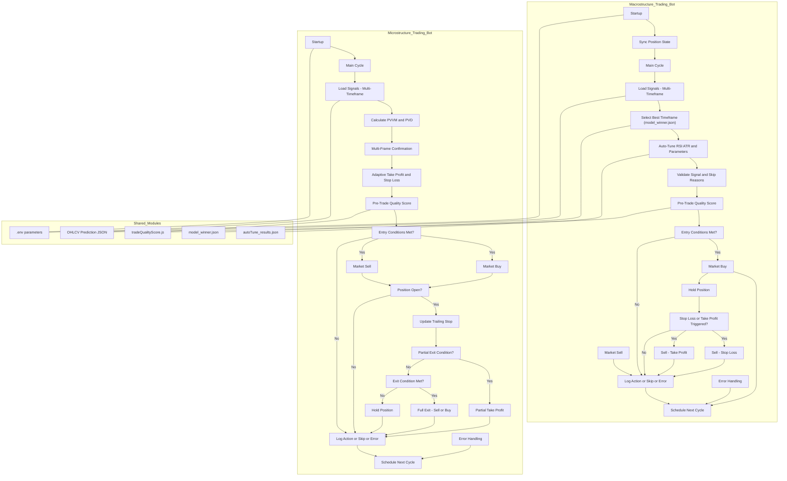

# Macrostructure Trading Bot (Auto-Tuned Multi-Timeframe)

## Overview

This bot automates macrostructure-based trading using robust signal analysis and dynamic parameter tuning.  
It is designed for cryptocurrency exchanges via the [ccxt](https://github.com/ccxt/ccxt) library, and makes use of multi-timeframe AI signals, auto-tuned model selection, and dynamic technical analysis metrics for trade execution and management.



**Main Features:**
- **Auto-selects best timeframe** (`1m`, `5m`, `15m`, `1h`) using `model_winner.json`
- **Auto-tuned parameters** (`RSI`, `ATR`, etc.) per timeframe
- **Robust signal updates**: checks for new signals, avoids duplicate actions
- **Dynamic stop-loss & take-profit**: thresholds scale with volatility and are configurable
- **Granular debug logging**: every action and skip reason is logged for transparency
- **Clear skip reasons**: logs why trades are skipped (win rate, volatility, signal, balance, etc.)
- **Real trade execution** (if credentials are set)
- **Easy parameter tuning** via `.env` and auto-tuning files
- **Multi-timeframe analysis** for enhanced robustness
- **Stateful position management** (open/closed detection, entry price tracking)

---

## How It Works

1. **Loads latest prediction signals** from OHLCV JSON files for all configured timeframes.
2. **Analyzes model winner data** from `model_winner.json` to determine the best timeframe for trading (based on win rate, volatility, and model activation).
3. **Auto-tunes technical analysis intervals** (RSI, ATR) for each timeframe using best parameters or sensible defaults.
4. **Validates trade signals**:
    - Checks for duplicate or already-processed signals
    - Ensures aggregation interval and minimum win rate are satisfied
    - Skips trades if volatility is too high or model is inactive
    - Verifies sufficient balance before trading
5. **Executes trades**:
    - **BUY**: When the winner label is `"strong_bull"` and RSI is below threshold
    - **SELL**: When the winner label is `"strong_bear"` and RSI is above threshold
    - **STOP-LOSS/TAKE-PROFIT**: Automatic based on entry price and configured thresholds
6. **Logs all actions, skips, and errors** with full context for audit and debugging.
7. **Schedules next bot cycle** with a delay determined by action type (trade, skip, hold, error).

---

## File Structure

- **Main code:** `macro_ccxt_orders_optimized.js`
- **Prediction files:** `logs/json/ohlcv/ohlcv_ccxt_data_{TIMEFRAME}_prediction.json`
- **Order log:** `logs/ccxt_order.log`
- **Model winner:** `challenge/model_winner.json`
- **Auto-tuning parameters:** `evaluation/autoTune_results.json`
- **.env file:** Contains API credentials and runtime parameters

---

## Key Parameters

| Parameter                   | Description                               | Example / Default      |
|-----------------------------|-------------------------------------------|------------------------|
| `EXCHANGE`                  | Exchange name supported by ccxt           | `"kraken"`             |
| `API_KEY`, `API_SECRET`     | Exchange API credentials                  | *(from .env)*          |
| `PAIR`                      | Trading pair                              | `"BTC/EUR"`            |
| `ORDER_AMOUNT`              | Default order size                        | `0.0001`               |
| `MIN_ALLOWED_ORDER_AMOUNT`  | Minimum trade size                        | `0.0001`               |
| `MAX_ORDER_AMOUNT`          | Maximum trade size                        | `0.01`                 |
| `OHLCV_CANDLE_SIZE`         | Timeframes to monitor                     | `"1m,5m,15m,1h"`       |
| `STOP_LOSS_PCT`             | Stop-loss threshold (fraction)            | `0.003` (0.3%)         |
| `TAKE_PROFIT_PCT`           | Take-profit threshold (fraction)          | `0.006` (0.6%)         |
| `MACRO_MIN_WIN_RATE`        | Minimum win rate for model activation     | `0.2`                  |
| `MACRO_MAX_VOLATILITY`      | Maximum volatility for trading            | `100`                  |
| `INTERVAL_AFTER_TRADE`      | Wait (ms) after trade                     | `30000`                |
| `INTERVAL_AFTER_SKIP`       | Wait (ms) after skip                      | `90000`                |
| `INTERVAL_AFTER_HOLD`       | Wait (ms) after hold/no action            | `180000`               |
| `INTERVAL_AFTER_ERROR`      | Wait (ms) after error                     | `60000`                |

---

## Trading Logic

### Timeframe & Signal Selection

- Bot reads `model_winner.json` and selects the best active timeframe (highest win rate, below volatility threshold, with an active model).
- Loads the latest prediction signal for the chosen timeframe.
- Uses `prediction_{model}` and `label_{model}` keys for signal analysis if available.

### Entry & Exit Criteria

- **BUY**:
    - No position open
    - Winner label is `"strong_bull"`
    - RSI below buy threshold
    - Sufficient quote currency balance

- **SELL**:
    - Position open
    - Winner label is `"strong_bear"`
    - RSI above sell threshold
    - Sufficient base currency balance

- **STOP LOSS / TAKE PROFIT**:
    - If current price drops below stop-loss, or rises above take-profit, bot triggers a sell.
    - Action is logged and position is closed.

- **SKIP/NO-TRADE**:
    - If signal has been processed, aggregation interval not met, model inactive, win rate/volatility out of bounds, or insufficient balance.
    - Each skip reason is logged for review.

### Technical Analysis

- **PVVM/PVD Calculation**:
    - Measures recent volatility and price difference from prediction files for additional context.
- **RSI/ATR Scoring**:
    - Uses dynamic intervals per timeframe, auto-tuned for optimal profit (with fallback defaults).
    - RSI thresholds for buy/sell are configurable.

### Logging & Debugging

- Every action, skip, and error is logged to `ccxt_order.log` with:
    - Timestamp
    - Trade details
    - Model used
    - Prediction and label info
    - Reason for action or skip
    - Full signal and scoring context
    - Win rate, volatility, and dominant periods

---

## Safety and Usage Notes

- **REAL TRADES:** If API keys are set, bot will execute trades on your exchange account.
- **Shorts:** On spot accounts, bot only sells what you own. For true shorting, margin/futures must be enabled.
- **Prediction Files:** Bot requires up-to-date prediction files for each timeframe.
- **Parameter Tuning:** All thresholds and intervals can be adjusted in `.env` or via auto-tune files.
- **Error Handling:** Bot logs and waits after errors to avoid rapid retries.

---

## Example Startup Log

```
[DEBUG] Starting macro_ccxt_orders_optimized.js with multi-timeframe auto-selection and enhanced analysis
[Startup] No open position detected. Starting flat.
[DEBUG] Scheduling next run in 180s. Reason: No multi-timeframe prediction signals found.
```

---

## References

- [CCXT Library](https://github.com/ccxt/ccxt)
- [explorer.js Prediction File Format]
- [Your Exchange API Documentation]
- [Auto-tuning/Model Selection Logic]

---

## Disclaimer

> This software executes trades automatically and can result in financial loss.
> Use at your own risk. Ensure you understand your exchange, account permissions, and the bot’s logic before running live.

