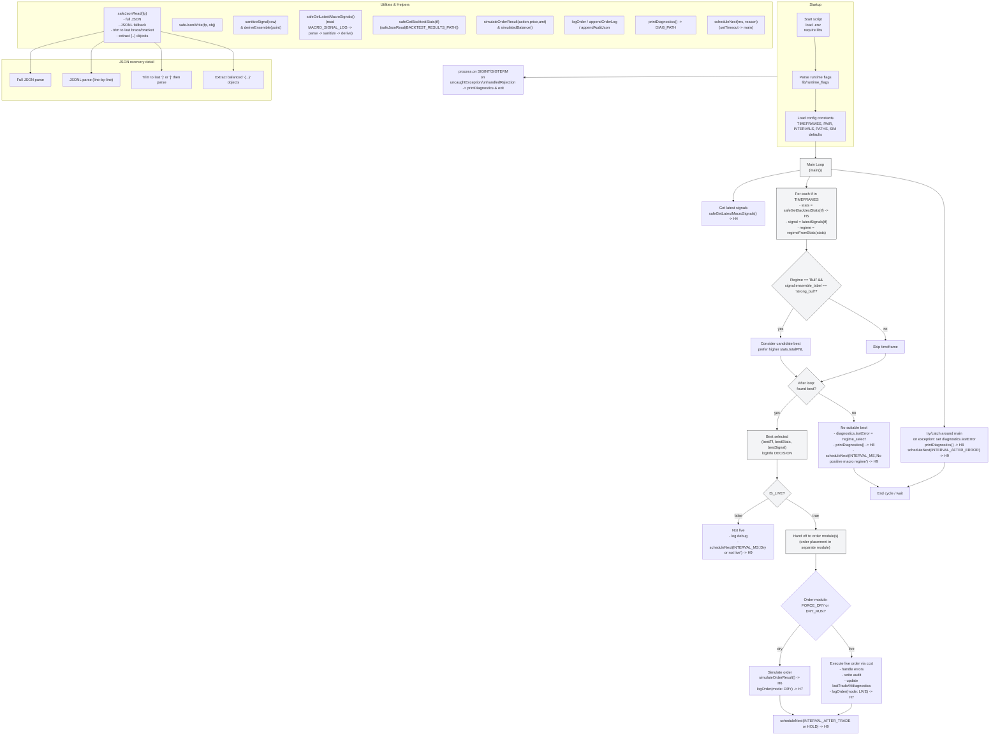

# Macrostructure (Auto-Tuned Multi-Timeframe)




## Overview

This document describes the Macrostructure trading orchestrator used in this repository. The orchestrator is implemented as a safe, DRY-run-first macro-level bot that selects a dominant timeframe using prediction files and backtest statistics, scores regimes, and delegates trade execution to order modules. It focuses on robust input handling, safe defaults, clear diagnostics, reproducible audit logs, and explicit live/dry behavior separation.

Key implementation file:
- tools/macro_ccxt_orders.js — the orchestrator (optimized, safer, DRY-first)

High-level goals:
- Use multi-timeframe model winners and per-timeframe predictions to pick a trading regime.
- Prefer DRY_RUN / simulation by default and only execute live orders when explicit live flags are set.
- Be resilient to corrupted or partial JSON logs and prediction files.
- Provide structured audit logging (JSONL) and legacy tab-separated logs for post-processing.
- Maintain simple scheduling and cooldown logic to avoid rapid repeated trades.

## What changed (high-level)

This revision documents changes introduced by the optimized orchestrator:
- DRY_RUN-first behavior (safe simulation defaults).
- FORCE_DRY and explicit ENABLE_LIVE / IS_LIVE guards to avoid accidental live trades.
- Consolidated configuration and constants loaded from `.env`.
- Robust JSON reading utilities with multiple recovery strategies:
  - Normal parse
  - JSONL fallback
  - Truncation-based recovery (trim to last brace/bracket)
  - Top-level object extraction from corrupted files
- Structured JSONL audit file plus legacy log export.
- Diagnostic snapshot writer (prevents ReferenceError and ensures safe diagnostics).
- Reduced noisy state logs by cooldown for HOLD messages and only logging state changes.
- Centralized scheduling with safe error handling and retry-on-failure.
- Backtest stats loader with tolerant matching by timeframe and strategy.

## Repository files referenced

- tools/macro_ccxt_orders.js — Macro orchestrator (coordinator). Key exported functions:
  - main()
  - safeGetLatestMacroSignals()
  - simulateOrderResult()
  - safeGetBacktestStats()
- tools/lib/runtime_flags.js — runtime flag parser (used by the orchestrator)
- logs/
  - logs/macro_signal.log — NDJSON/JSONL macro signals (one JSON object per line).
  - logs/macro_ccxt_orders.log — legacy tab-separated order log.
  - logs/macro_ccxt_orders_audit.jsonl — JSONL structured audit trail per action.
  - logs/macro_diagnostics.json — human-readable diagnostics snapshot.
- backtest/backtest_results.json — backtest results referenced by timeframe.
- challenge/model_winner.json — (optional) model winner data used by other modules.
- evaluation/autoTune_results.json — (optional) auto-tune parameter outputs referenced elsewhere.
- .env — configuration and credential file (not committed to repo).

## How it works (workflow)

1. Load runtime flags and `.env` configuration early.
2. Read latest macro signals from logs/macro_signal.log (JSONL). For each configured timeframe the latest signal is sanitized and an ensemble label/confidence is derived.
3. Load tolerant backtest stats (backtest/backtest_results.json) to determine regime (Bull/Bear/Flat).
4. Select the best timeframe where:
   - Stats exist for the timeframe
   - A valid signal exists
   - The regime and signal align (e.g., Bull + strong_bull)
   - Prefer the timeframe with the better PnL (totalPNL)
5. If no suitable best timeframe is found, schedule the next run and write diagnostics.
6. If IS_LIVE is false (the default safe mode), the orchestrator logs the decision and schedules the next run — no live order placement is performed by this module.
7. If IS_LIVE is true, this orchestrator is allowed to hand off to order modules which perform exchange requests. The orchestrator contains safe guards and will only proceed when explicit env flags allow it.
8. Every cycle writes structured audit lines for actions, reasons, signals and diagnostics.

## Important safety principles

- Default to simulation unless all runtime flags explicitly indicate live operation:
  - DRY_RUN = simulation mode (true by default via flags)
  - FORCE_DRY = enforce dry-run even if ENABLE_LIVE is set
  - ENABLE_LIVE and IS_LIVE must be set intentionally to enable live mode
- Audit trail is always written (JSONL) for post-run analysis.
- Diagnostic snapshots are persisted to logs/macro_diagnostics.json for quick debugging.
- Backoff/scheduling ensures we do not spam order endpoints or repeat operations too quickly.
- Use local tests and the DRY_RUN mode before enabling live execution on any account with real funds.

## Configuration (environment variables)

The orchestrator reads configuration from `.env` (or environment). Key variables:

- MACRO_TIMEFRAMES — comma-separated timeframes to monitor (default: `1m,5m,15m,1h`)
- MACRO_PAIR or PAIR — trading pair (default: `BTC/EUR`)
- ORDER_AMOUNT — default order size (e.g. `0.0001`)
- MIN_ALLOWED_ORDER_AMOUNT — minimum allowed trade size
- MAX_ORDER_AMOUNT — maximum allowed trade size
- INTERVAL_AFTER_TRADE — ms to wait after a trade (default: 30000)
- INTERVAL_AFTER_SKIP — ms to wait after skipping an action (default: 90000)
- INTERVAL_AFTER_HOLD — ms to wait after hold/no action (default: 180000)
- INTERVAL_AFTER_ERROR — ms to wait after an error (default: 60000)
- MACRO_EXCHANGE — exchange name used by order modules (e.g., `kraken`)
- MACRO_KEY, MACRO_SECRET — exchange keys (not required for DRY_RUN)
- MACRO_BACKTEST_JSON_PATH — optional custom path to backtest results
- SIM_PRICE — price to use in simulation (default: 30000)
- SIM_BASE_BALANCE — simulated base asset free balance (default: 0.01)
- SIM_QUOTE_BALANCE — simulated quote asset free balance (default: 1000)
- MACRO_MIN_WIN_RATE — minimum win rate to activate models (default: 0.2)
- HOLD_LOG_COOLDOWN_MS — ms cooldown for repeated HOLD logs (default: 5 minutes)
- DRY_INTERVAL_MS — scheduling interval while in DRY_RUN (default: 15000)
- MACRO_INTERVAL_MS — nominal interval when not DRY_RUN (default: 180000)
- MACRO_ORDER_THROTTLE_MS — throttle between orders to same pair (default: 12 * 60 * 1000)
- DEBUG — enable debug logging and extra diagnostics (set to `1` or truthy)

Runtime flags (provided by tools/lib/runtime_flags.js):
- DRY_RUN (boolean)
- FORCE_DRY (boolean)
- ENABLE_LIVE (boolean)
- IS_LIVE (boolean)
- DEBUG (boolean)

Example `.env` snippet:
````bash
MACRO_TIMEFRAMES=1m,5m,15m,1h
MACRO_PAIR=BTC/EUR
ORDER_AMOUNT=0.0001
MACRO_EXCHANGE=kraken
SIM_PRICE=30000
SIM_BASE_BALANCE=0.01
SIM_QUOTE_BALANCE=1000
MACRO_BACKTEST_JSON_PATH=./backtest/backtest_results.json
DRY_RUN=1
FORCE_DRY=1
DEBUG=1
