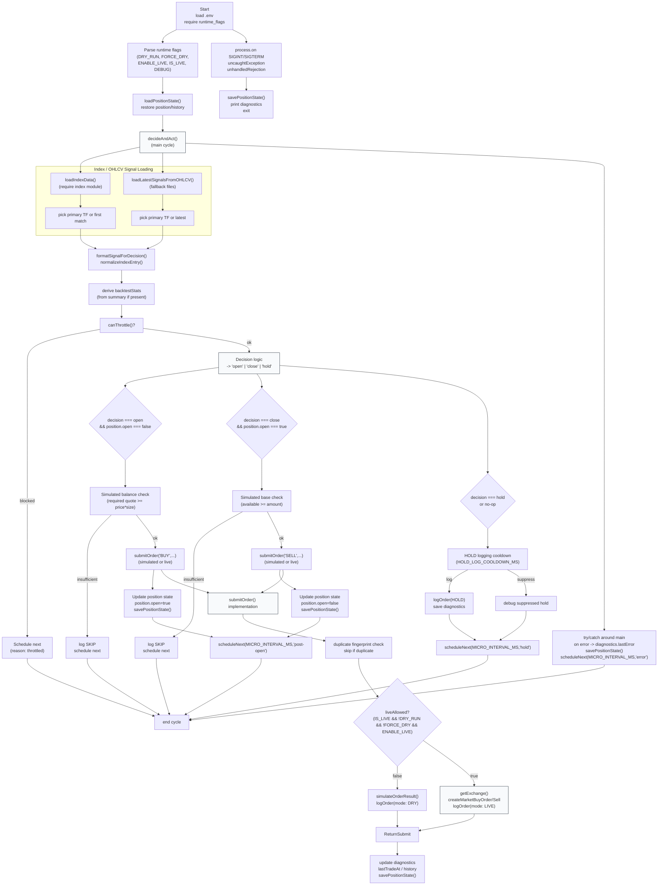

# tools/microstructure — Microstructure (micro_ccxt_orders.js)

This document describes the microstructure orchestrator implemented at:
`tools/microstructure/micro_ccxt_orders.js`.



- Startup
  - Loads .env early and parses runtime flags using `tools/lib/runtime_flags`.
  - Restores persisted position and diagnostics from `tools/logs/micro_position_state.json`.

- Signal input
  - Primary source: `loadIndexData()` (the index module under `tools/microstructure/index.js`).
  - Fallback: prediction JSON files in `OHLCV_DIR`.
  - `formatSignalForDecision()` normalizes the picked entry for decision logic.

- Decisioning
  - `decideAndAct()` performs throttling, simple gating (score/winRate/ensemble labels), then selects open/close/hold.
  - `shouldOpenPosition` / `shouldClosePosition` helpers are represented by the decision logic in the code.

- Order submission
  - `submitOrder()` is a single entry point that:
    - Prevents immediate duplicate submissions via a fingerprint.
    - Uses strict `IS_LIVE` + `ENABLE_LIVE` + `!DRY_RUN` + `!FORCE_DRY` checks to permit live exchange access.
    - When live is disallowed, uses `simulateOrderResult()` and writes audit JSONL and legacy log lines.
    - When live is allowed, obtains ccxt exchange with `getExchange()` and places market orders, handling both `createMarketBuyOrder`/`createOrder` fallbacks.
    - Updates diagnostics, persists position state and history.

- Persistence and scheduling
  - Position state and small history are saved to `tools/logs/micro_position_state.json`.
  - Scheduling uses a single timer (`scheduleNext`) and also a fallback `setInterval` watchdog.
  - Errors capture diagnostics and persist state before exit.

- Safety
  - Live orders are explicitly gated; defaults favor simulation.
  - Diagnostic history and audit logs facilitate reconciliation.

## File locations & key env variables

- Main script: `tools/microstructure/micro_ccxt_orders.js`
- Index module (preferred source): `tools/microstructure/index.js`
- OHLCV fallback directory: `TOOLS_OHLCV_DIR` (env `OHLCV_DIR`, default `tools/logs/json/ohlcv`)
- Position state: `tools/logs/micro_position_state.json`
- Logs:
  - Legacy tab log: `tools/logs/micro_ccxt_orders.log`
  - Audit JSONL: `tools/logs/micro_ccxt_order_audit.jsonl`
- Important env flags:
  - DRY_RUN, FORCE_DRY, ENABLE_LIVE, IS_LIVE, DEBUG
  - MICRO_PAIR, MICRO_TIMEFRAMES, MICRO_PRIMARY_TF
  - MICRO_ORDER_AMOUNT, MICRO_INTERVAL_MS
  - SIM_PRICE, SIM_BASE_BALANCE, SIM_QUOTE_BALANCE
  - ORDER_THROTTLE_MS, HOLD_LOG_COOLDOWN_MS

## Example quickstart

- Dry-run single cycle:
```
DRY_RUN=1 node tools/microstructure/micro_ccxt_orders.js --once
```

- Continuous dry-run:
```
DRY_RUN=1 node tools/microstructure/micro_ccxt_orders.js
```

## Notes, troubleshooting and extension points

- If `loadIndexData()` fails or index module is not present, the fallback to OHLCV files will be used.
- The submitter fingerprints use rounded price and scaled amount — change fingerprint scheme if you need finer duplicate control.
- Consider adding a persisted last-run marker to avoid reprocessing identical index entries after restart.
- The code already centralizes live checks; to extend to margin/futures, modify `getExchange()` and `submitOrder()` with care.
- Unit-testable functions exported: `decideAndAct`, `submitOrder`, `loadPositionState`, `savePositionState`, `formatSignalForDecision`.

---
