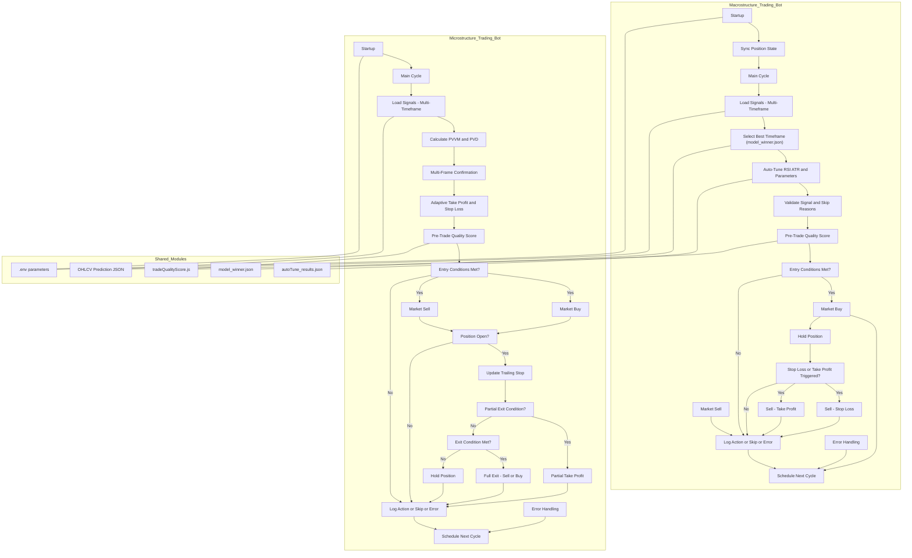

# Microstructure Trading Bot (Advanced)

/**
 * Microstructure trading bot: ADVANCED dynamic profit/loss management.
 * Features: Trailing stops, adaptive thresholds, partial exits, multi-frame confirmation, adaptive sizing, smart re-entry logic.
 * Uses explorer.js OHLCV multi-timeframe prediction files from logs/json/ohlcv.
 * WARNING: Executes real trades if credentials are set! 
 * Optimized with DEBUG messages and daily trade limit.
 * Supports both strong_bull and strong_bear entries (long/short).
 */

## Overview

This bot automates microstructure trading using advanced dynamic profit/loss management.  
It is designed to operate on cryptocurrency exchanges via the [ccxt](https://github.com/ccxt/ccxt) library, using multi-timeframe AI signals for position management, and supports both long (buy) and short (sell) strategies.

**Main Features:**
- Trailing stops (dynamic stop-loss)
- Adaptive profit/loss thresholds (volatility-based)
- Partial exits (take profit on part of position, not all at once)
- Multi-frame confirmation (uses multiple timeframes for signal agreement)
- Adaptive position sizing (risk control via volatility)
- Smart re-entry logic (prevents overtrading)
- Daily trade limit (protects against excessive trades)
- DEBUG logging (easy troubleshooting and transparency)
- Real trading if API credentials are provided

---

## How It Works

1. **Reads OHLCV prediction files** generated by `explorer.js` from multiple timeframes.
2. **Analyzes market conditions** using PVVM (mean volatility) and PVD (mean price difference).
3. **Confirms trade signals** only if all selected timeframes agree (`ensemble_label` is the same).
4. **Adapts thresholds and position size** based on current volatility.
5. **Executes trades**:
    - **Long (Buy):** When signal is `"strong_bull"` and conditions are met.
    - **Short (Sell):** When signal is `"strong_bear"` and conditions are met (simulated short for spot; real short if margin/futures).
6. **Manages open positions**:
    - Trailing stop-loss is updated every interval.
    - Partial take profit triggers when price target is hit.
    - Full exit triggers on stop-loss, timeout, or full take profit.
7. **Limits daily trades** to a configurable maximum (default: 4/day).
8. **Logs all actions** for tracking and debugging.

---

## File Structure

- **Main code:** `micro_ccxt_orders.js`
- **Prediction files:** `logs/json/ohlcv/ohlcv_ccxt_data_{TIMEFRAME}_prediction.json`
- **Order log:** `logs/micro_order.log`
- **Environment file:** `.env` (contains credentials and runtime params)

---

## Key Parameters

| Parameter                 | Description                                         | Example / Default      |
|---------------------------|-----------------------------------------------------|------------------------|
| `EXCHANGE`                | Exchange name supported by ccxt                     | `"kraken"`             |
| `API_KEY`, `API_SECRET`   | Exchange API credentials                            | *(from .env)*          |
| `PAIR`                    | Trading pair                                        | `"BTC/EUR"`            |
| `MICRO_ORDER_AMOUNT`      | Minimum order size                                  | `0.00005`              |
| `MICRO_INTERVAL_MS`       | Bot cycle interval (ms)                             | `60000` (1 minute)     |
| `BASE_PROFIT_PCT`         | Base take profit threshold                          | `0.005` (0.5%)         |
| `BASE_LOSS_PCT`           | Base stop loss threshold                            | `0.005` (0.5%)         |
| `TRAIL_STEP_PCT`          | Trailing stop step                                  | `0.002` (0.2%)         |
| `PARTIAL_EXIT_FRACTION`   | Fraction for partial exit                           | `0.5` (50%)            |
| `TOLERANCE_MS`            | Max hold time per trade (ms)                        | `1500000` (25 min)     |
| `MICRO_MAX_TRADES_PER_DAY`| Max trades per day                                  | `4`                    |
| `TIMEFRAME`               | Main prediction file timeframe                      | `"15m"` (configurable) |
| `MULTIFRAME_FILES`        | Timeframes for multi-frame confirmation             | `["5m","15m"]`         |

---

## Trading Logic

### Entry Conditions

- **No open position**
- **Re-entry allowed**
- **PVVM > 10** and **PVD > 10** (market is active/volatile)
- **Multi-frame label is `"strong_bull"`** (buy) or **`"strong_bear"`** (sell)
- **Sufficient balance** to execute trade
- **Daily trade limit** not exceeded

### Position Management

- **Trailing Stop:**  
  Adjusted every cycle based on price movement and position type (long/short).
- **Partial Take Profit:**  
  If price reaches take profit target, sell/buy back a fraction of position.
- **Full Exit:**  
  If price hits stop-loss, timeout, or all profit taken, close the position entirely.

### Trade Types

| Signal        | Action          | Exchange Requirement         |
|---------------|----------------|-----------------------------|
| `strong_bull` | Market Buy      | Sufficient quote currency   |
| `strong_bear` | Market Sell     | Sufficient base currency    |

> **Note:** On spot exchanges, "short selling" is simulated by selling what you own and buying back later. For true shorting, margin/futures must be enabled.

---

## DEBUG Logging

All major actions and state changes are logged with `[DEBUG]` including:
- Threshold calculations
- Signal selection
- Order submissions
- Trailing stop updates
- Trade limit enforcement
- Balance checks
- Position management

Order history is also appended to `micro_order.log` for audit and review.

---

## Safety and Usage Notes

- **REAL TRADES:** If you set real API keys, the bot will trade with your funds.  
  Use test keys or a test environment to validate logic before running live.
- **Shorts:** True short selling requires margin/futures support. Otherwise, bot only sells your existing holdings.
- **Prediction Files:** The bot requires up-to-date prediction files in the specified directory.
- **Parameter Tuning:** All thresholds, intervals, and limits can be adjusted for your strategy and risk tolerance.

---

## Example Startup Log

```
[DEBUG] Starting micro_ccxt_orders_optimized_v2.js ADVANCED for timeframe 15m using: /logs/json/ohlcv/ohlcv_ccxt_data_15m_prediction.json
[DEBUG] Adaptive thresholds: profit_pct=0.01, loss_pct=0.01, volatility=113.12
[DEBUG] Multi-frame labels: strong_bear, strong_bear | Agreed: true
[DEBUG] Signal label selected: strong_bear
[DEBUG] Adaptive order size: 0.00005 (volatility=113.12)
[DEBUG] SHORT SELL order submitted. Adaptive size=0.00005, thresholds: TP=0.01, SL=0.01. tradesToday=1
...
```

---

## References

- [CCXT Library](https://github.com/ccxt/ccxt)
- [Your Exchange API Documentation]
- [explorer.js Prediction File Format]

---

## Disclaimer

> This software executes trades automatically and can result in financial loss.
> Use at your own risk. Ensure you understand your exchange, account permissions, and the bot’s logic before running live.

