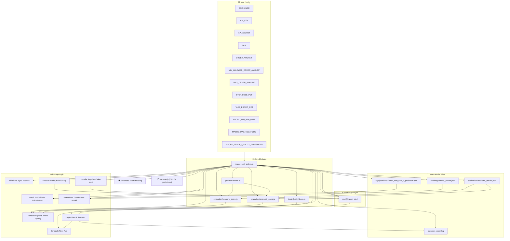

# 📊 `macro_ccxt_orders.js` — Macrostructure Trading Bot

---

## Overview

This bot is an advanced, auto-tuned, multi-timeframe cryptocurrency trading engine built on [ccxt](https://github.com/ccxt/ccxt) and designed to make robust, automated trading decisions. It dynamically selects the best model and timeframe for trading, uses real-time OHLCV predictions, and scores trades for quality before execution.

---


## 🚀 Features

- **Auto-Tuning & Model Selection:**  
  Automatically selects the optimal timeframe (`1m`, `5m`, `15m`, `1h`) and model using `model_winner.json`.

- **Multi-Timeframe Prediction:**  
  Loads and evaluates prediction files for multiple timeframes in parallel for improved robustness.

- **Live Trading Support:**  
  Executes real trades if API credentials are provided. Supports Kraken and any ccxt-supported exchanges.

- **Dynamic Signal Scoring:**  
  Uses dynamic RSI and ATR intervals per timeframe for adaptive market analysis.

- **Trade Quality Evaluation:**  
  Integrates a pre-trade and post-trade quality scoring system to minimize poor trades.

- **Granular Logging:**  
  Every action and skip reason is logged with full context for transparency and auditability.

- **Enhanced Error Handling:**  
  Optimized for stability and recovery from exchange/API errors.

---

## 🧩 Main Components

### 1. **Configuration & Environment**
- Loads API keys, trading pair, and bot parameters from `.env`.
- Sets up paths for logs, prediction data, and model selection.

### 2. **Exchange Initialization**
- Initializes the ccxt exchange object using provided credentials.

### 3. **Utility Functions**
- **RSI/ATR Interval Selection:**  
  Returns dynamic interval values per timeframe, auto-tuned for profit.
- **PVVM/PVD Calculation:**  
  Measures price volatility and variation from prediction files.
- **Signal & Order Logging:**  
  Logs all trade attempts, skips, and outcomes with detailed context.

### 4. **Signal Processing & Model Selection**
- Loads latest prediction signals and winner analysis.
- Selects best timeframe/model based on win rate and volatility thresholds.

### 5. **Trade Validation & Execution**
- Checks if signals are valid, already processed, or if trading intervals are met.
- Evaluates trade quality; skips poor trades automatically.
- Executes buy/sell orders based on signal strength, RSI, and account balance.
- Handles stop-loss and take-profit conditions.

### 6. **Error Handling & Scheduling**
- Catches and logs uncaught exceptions and rejections.
- Schedules next bot run based on outcome (trade, skip, hold, or error).

---

## 🔗 Key External Dependencies

- [ccxt](https://github.com/ccxt/ccxt): Unified cryptocurrency trading API.
- [dotenv](https://github.com/motdotla/dotenv): Loads `.env` configurations.
- Local modules for scoring and parameter optimization:
  - `scoreRSI`, `scoreATR` — Signal scoring.
  - `getBestParam` — Parameter optimization.
  - `scoreTrade` — Trade quality evaluation.

---

## ⚙️ Configuration (.env)

| Variable                  | Description                                    | Default      |
|---------------------------|------------------------------------------------|--------------|
| `EXCHANGE`                | Exchange name (e.g., `kraken`)                 | kraken       |
| `KEY`, `SECRET`           | API credentials                                | (empty)      |
| `PAIR`                    | Trading pair                                   | BTC/EUR      |
| `ORDER_AMOUNT`            | Amount per order                               | 0.0001       |
| `MIN_ALLOWED_ORDER_AMOUNT`| Minimum order size allowed                     | 0.0001       |
| `MAX_ORDER_AMOUNT`        | Maximum order size per trade                   | 0.01         |
| `STOP_LOSS_PCT`           | Stop loss percent (e.g., `0.003`)              | 0.003        |
| `TAKE_PROFIT_PCT`         | Take profit percent (e.g., `0.006`)            | 0.006        |
| `MACRO_MIN_WIN_RATE`      | Minimum win rate to consider a model/timeframe | 0.2          |
| `MACRO_MAX_VOLATILITY`    | Maximum volatility allowed                     | 100          |

---

## 📝 Logging Format

Order logs are written as tab-separated lines to `tools/logs/ccxt_order.log`, including:

- Timestamp
- Signal parameters
- Action (BUY, SELL, SKIP, HOLD, STOP_LOSS, TAKE_PROFIT)
- Result/Reason (including errors)
- Full signal, RSI, ATR scores, win rate, volatility, model info
- Trade quality score and breakdown

---

## 🛡️ Safety & Robustness

- Bot automatically skips trades if signals are duplicated, invalid, or trading conditions are not met.
- Avoids poor trades using trade quality scoring.
- Handles all exceptions gracefully, logs all errors, and reschedules itself.

---

## 🧵 Main Loop Logic

1. **Initialize and Sync Position**
2. **Batch PVVM/PVD Calculations**
3. **Select Best Timeframe & Model**
4. **Validate Signal and Trade Quality**
5. **Execute Trade (BUY/SELL) or HOLD**
6. **Handle Stop-loss/Take-profit**
7. **Log all actions and reasons**
8. **Schedule next run based on outcome**

---

## 📂 File Structure

- `tools/macro_ccxt_orders.js` — Main trading bot file
- `tools/evaluation/score/rsi_score.js` — RSI scoring logic
- `tools/evaluation/score/atr_score.js` — ATR scoring logic
- `tools/getBestParams.js` — Parameter optimization
- `tools/tradeQualityScore.js` — Trade quality scoring
- `tools/evaluation/autoTune_results.json` — Auto-tuning results
- `tools/challenge/model_winner.json` — Model selection data
- `tools/logs/ccxt_order.log` — Order execution logs
- `tools/logs/json/ohlcv/ohlcv_ccxt_data_*_prediction.json` — OHLCV prediction signals per timeframe

---

## 📣 Usage

> **Note:**  
> Ensure your `.env` file is set up with valid exchange credentials and parameters.  
> Prediction JSON files must be generated by `explorer.js` or similar data source.

Run the bot:
```bash
node tools/macro_ccxt_orders.js
```

---

## 🧑‍💻 Example Log Entry

```text
2025-09-27T15:00:00.000Z    1695826800000    modelA    39000    strong_bull    BUY    SUCCESS    {"id":"order123","price":39000}    Winner strong_bull & RSI < 30 on 1m (RSI=25, interval=6)    {...fullSignal...}    {...rsiScores...}    {...atrScores...}    0.41    70    modelA    [1m,5m]    92    {"signalStrength":90,"modelWinRate":0.41,"riskReward":2,"executionQuality":90,"volatility":70,"tradeOutcome":null}
```

---

## 🏆 Best Practices

- **Monitor logs:** Regularly review `ccxt_order.log` for skipped trades and errors.
- **Tune parameters:** Use auto-tuning and trade quality analysis to refine strategy.
- **Update prediction files:** Ensure OHLCV prediction files are kept up-to-date for accurate signals.

---

## 📘 Further Reading

- [CCXT Documentation](https://github.com/ccxt/ccxt)
- [Kraken API Docs](https://docs.kraken.com)
- [RSI/ATR Indicators](https://www.investopedia.com/terms/r/rsi.asp), [ATR](https://www.investopedia.com/terms/a/atr.asp)
- [Trade Quality Scoring](https://www.investopedia.com/articles/trading/08/trade-quality.asp)

---

## 🖼️ Icon

```
📊
```

---

## ⚠️ Disclaimer

This bot executes real trades if credentials are enabled. Use at your own risk. Always test with demo credentials before live deployment.
