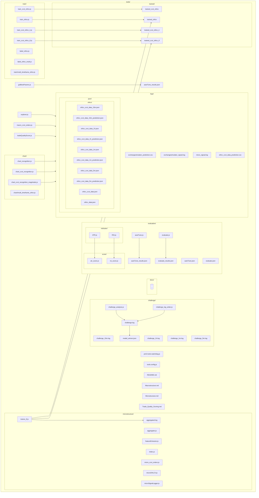

**Detailed diagram schema** of the `tools/` directory tree.

---

```
tools/
├── autoTune_results.json                  # Results of auto-tuning (likely strategy/model parameters)
├── challenge/                            # Challenge-related logs, analysis, and model selection
│   ├── challenge_15m.log                 # Log for 15-minute challenge
│   ├── challenge_1h.log                  # Log for 1-hour challenge
│   ├── challenge_1m.log                  # Log for 1-minute challenge
│   ├── challenge_5m.log                  # Log for 5-minute challenge
│   ├── challenge_analysis.js             # JS script for challenge analysis
│   ├── challenge.log                     # General challenge log
│   ├── challenge_log_writer.js           # JS script for writing challenge logs
│   └── model_winner.json                 # Stores winning model info
├── chart/                                # Charting and recognition scripts
│   ├── chart_ccxt_recognition.js         # Chart recognition using ccxt data
│   ├── chart_ccxt_recognition_magnitude.js  # Magnitude recognition for ccxt charts
│   ├── chart_recognition.js              # General chart recognition
│   └── multi_timeframe_ohlcv.js          # Multi-timeframe OHLCV data handling
├── docs/                                 # Documentation
├── evaluation/                           # Evaluation scripts, results, scoring
│   ├── autoTune.js                       # JS script for auto-tuning
│   ├── autoTune.json                     # Auto-tune configuration
│   ├── autoTune_results.json             # Auto-tune results (copy)
│   ├── evaluate.js                       # JS script for evaluation
│   ├── evaluate.json                     # Evaluation configuration
│   ├── evaluate_results.json             # Evaluation results
│   ├── indicator/                        # Technical indicators scripts
│   │   ├── ATR.js                        # ATR indicator
│   │   └── RSI.js                        # RSI indicator
│   └── score/                            # Scoring scripts for indicators
│       ├── atr_score.js                  # ATR scoring logic
│       └── rsi_score.js                  # RSI scoring logic
├── explorer.js                           # Explorer utility script
├── getBestParams.js                      # Script to extract best parameters
├── logs/                                 # Logs and related data
│   ├── exchangesimulator_prediction.csv  # Predictions from exchange simulator
│   ├── exchangesimulator_signal.log      # Signal logs from exchange simulator
│   ├── json/                             # JSON logs and OHLCV data
│   │   └── ohlcv/
│   │       ├── ohlcv_ccxt_data_15m.json
│   │       ├── ohlcv_ccxt_data_15m_prediction.json
│   │       ├── ohlcv_ccxt_data_1h.json
│   │       ├── ohlcv_ccxt_data_1h_prediction.json
│   │       ├── ohlcv_ccxt_data_1m.json
│   │       ├── ohlcv_ccxt_data_1m_prediction.json
│   │       ├── ohlcv_ccxt_data_5m.json
│   │       ├── ohlcv_ccxt_data_5m_prediction.json
│   │       ├── ohlcv_ccxt_data.json
│   │       └── ohlcv_data.json
│   ├── micro_signal.log                  # Microstructure signal log
│   └── ohlcv_ccxt_data_prediction.csv    # OHLCV prediction data
├── macro_ccxt_orders.js                  # Macro-level ccxt orders script
├── Macrostructure.md                     # Macrostructure documentation
├── microstructure/                       # Microstructure scripts and logs
│   ├── aggregated.log                    # Aggregated microstructure log
│   ├── aggregator.js                     # Aggregator script
│   ├── featureExtractor.js               # Feature extractor for microstructure
│   ├── index.js                          # Entry point for microstructure
│   ├── micro_ccxt_orders.js              # Micro-level ccxt orders script
│   ├── microOHLCV.js                     # Micro OHLCV data handler
│   ├── microSignalLogger.js              # Logger for microstructure signals
│   └── trainer_tf.js                     # Trainer using TensorFlow
├── Microstructure.md                     # Microstructure documentation
├── pm2-tools-watchdog.js                 # PM2 watchdog utility script
├── README.md                             # Tools directory documentation
├── tools.config.js                       # Config file for tools
├── tradeQualityScore.js                  # Trade quality scoring logic
├── Trade_Quality_Scoring.md              # Documentation for trade quality scoring
├── train/                                # Training scripts for various OHLCV models
│   ├── label_ohlcv.js                    # Labeling OHLCV data
│   ├── label_ohlcv_multi.js              # Multi label OHLCV
│   ├── multi_timeframe_ohlcv.js          # Multi-timeframe OHLCV training
│   ├── train_ccxt_ohlcv_ir.js            # Train ccxt OHLCV IR model
│   ├── train_ccxt_ohlcv.js               # Train ccxt OHLCV model
│   ├── train_ccxt_ohlcv_tf.js            # Train ccxt OHLCV TensorFlow model
│   └── train_ohlcv.js                    # Train OHLCV model
└── trained/                              # Directory for trained models
    ├── trained_ccxt_ohlcv                # Trained ccxt OHLCV model (likely dir with files)
    ├── trained_ccxt_ohlcv_ir             # Trained ccxt OHLCV IR model
    ├── trained_ccxt_ohlcv_tf             # Trained ccxt OHLCV TensorFlow model
    └── trained_ohlcv                     # Trained OHLCV model

```

---

### **Schema Overview and Relationships**

- **configs & results**:  
  - `autoTune_results.json`, `tools.config.js`, `evaluate.json`, etc.  
  - Store configuration, parameters, and results for tuning/evaluation.

- **main functional areas**:
  - **challenge/**: Logging, analysis, and selection for model challenges.
  - **chart/**: Scripts for data visualization and recognition.
  - **evaluation/**: Scripts for auto-tuning, evaluating models, and indicator scoring.
  - **microstructure/** & **macro_ccxt_orders.js**: Scripts for trading data at different granularities.
  - **train/**: Model training scripts for various data and model types.
  - **trained/**: Saved models from training.

- **data & logs**:
  - **logs/**: Stores output and signal logs, especially for simulation and prediction.
  - **logs/json/ohlcv/**: Detailed OHLCV (Open/High/Low/Close/Volume) data in JSON format.

- **documentation**:
  - Markdown files describe structures, scoring, and usage.
  - `README.md` and other `.md` files in root and subdirs.

- **utilities**:
  - `explorer.js`, `getBestParams.js`, `pm2-tools-watchdog.js`: Utility scripts supporting operations and monitoring.

---

### **Diagram (ASCII Schema)**

Here’s an **entity-relationship style diagram** showing the logical connections:

```
[tools.config.js]      [README.md]
      |                      |
      |                 [Documentation]
      |
    [challenge/] <------> [evaluation/] <------> [train/] <------> [trained/]
      |                      |                      |                 |
      |                      |                      |                 |
[chart/]                 [logs/]                [microstructure/]    |
      |                      |                      |                |
[macro_ccxt_orders.js]   [logs/json/ohlcv/]   [micro_ccxt_orders.js] |
      |                      |                      |                |
[tradeQualityScore.js]   [Trade_Quality_Scoring.md] |                |
      |                      |                      |                |
[autoTune_results.json]  [Microstructure.md]        |                |
      |---------------------------------------------|----------------|
```

**Legend:**
- Boxes = directories/files.
- `<------>` = logical relationships/data flow.
- `[trained/]` = stores outputs/models from training scripts.
- `[logs/]` = stores data generated by scripts, used across challenge, evaluation, train.

---

## Tools Directory Structure & Data Flow

The following diagram illustrates the organization of the `tools/` directory, showing relationships between scripts, data files, logs, models, and supporting documentation. This is useful for onboarding, maintenance, and understanding how data flows through the toolkit.



### Diagram Legend

- **Folders** are shown as subgraphs; each contains its files/scripts.
- **Arrows** indicate typical data flows (e.g., training produces models, scripts write logs).
- **Key flows**: Training scripts create models, chart/microstructure scripts interact with logs, challenge scripts analyze and record results, indicators feed into scoring logic.

